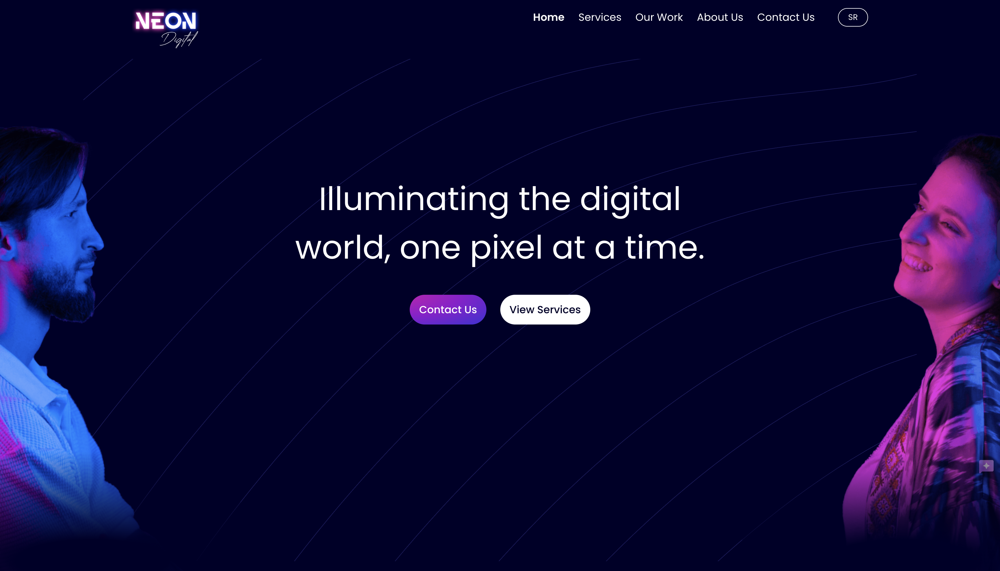
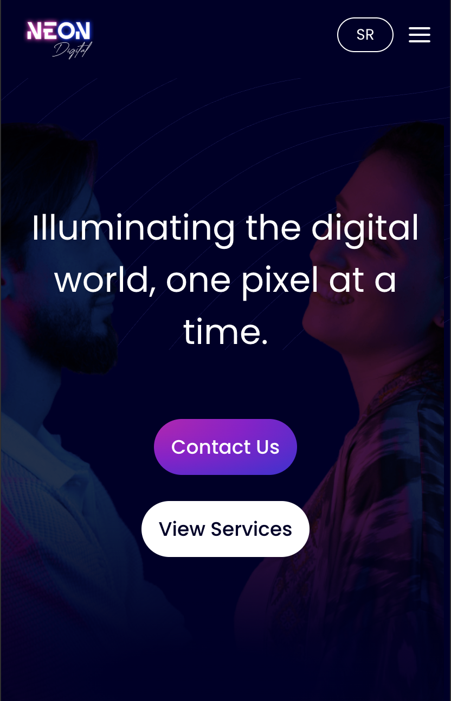
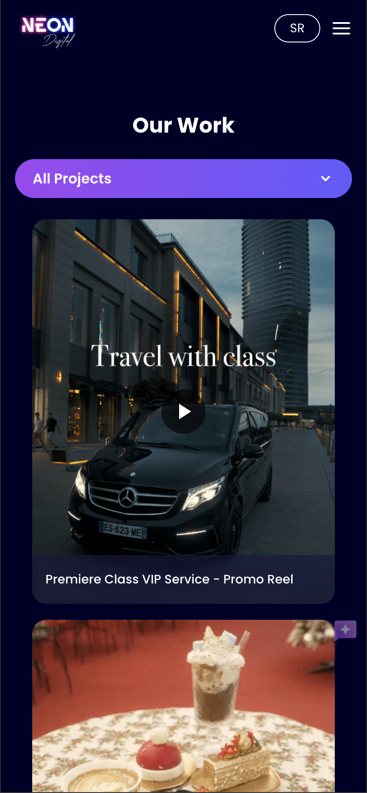

# 🌐 Neon Digital

**Fully responsive marketing website** developed with **HTML, CSS, Tailwind CSS, Vite** and JavaScript.  
Focused on performance, clean design, and smooth UX.

## 🚀 Tech Stack

- HTML5
- CSS3
- Tailwind CSS
- JavaScript (Vanilla)
- Vite
- Supabase (data)
- Fancybox (gallery)

##🧠 Overview

Modern, responsive marketing website focused on:

✨ Clean and smooth UX

⚡ Performance-first approach

📱 Fully mobile responsive

🌐 Multilingual support

🎥 Media-rich gallery (images & videos from Supabase)

##🔧 Features
🎯 Optimized Tailwind layout

🖼️ Dynamic gallery with Fancybox

🌍 Multilingual content with language switcher

📦 Vite for fast build and dev server

🔄 Modular JS using Stimulus controllers

☁️ Supabase (image DB) + Cloudinary (video hosting)

## 📸 Screenshots

### Homepage – Desktop


### Homepage – Mobile


### Gallery View – Desktop


### Gallery – Mobile


### Gallery – Desktop


## 🌐 Live Website  
[neondigital.rs](https://neondigital.rs)

## ☁️ Hosted on [Vercel](https://vercel.com)

## 📦 Installation

1. Clone the repository:
```
git clone https://github.com/andric-dusica/neon_digital.git
cd neon_digital
```

3. Install dependencies:
```
npm install
```

5. Run the development server:
```
npm run dev
```

7. Open in browser:
```
http://localhost:5173
```

⚙️ Build

To generate a production-ready build:
```
npm run build
```
The build output will be located in the dist/ folder.

🚀 Deployment
This project is deployed using Vercel.
Each push to the main branch triggers an automatic deployment to:

👉 https://neon-digital.vercel.app

## 📁 Project Structure

```
neon_digital/
├── public/                # Static files (images, videos, etc.)
├── assets/
│   └── screenshots/       # Screenshots used in README
├── js/                    # JavaScript controllers and modules
├── services/              # API services (e.g. Supabase)
├── locales/               # Translation files for i18n
├── about-us/              # About page
├── contact-us/            # Contact page
├── our-work/              # Work gallery
├── .env                   # Environment variables
├── index.html             # Main HTML entry point
├── README.md              # Project documentation
├── tailwind.config.js     # Tailwind CSS configuration
├── vite.config.js         # Vite build configuration
└── dist/                  # Production build output
```

## 📄 License

This project is licensed under the [MIT License](LICENSE).  
Feel free to use, modify, and distribute it for personal or commercial projects.


